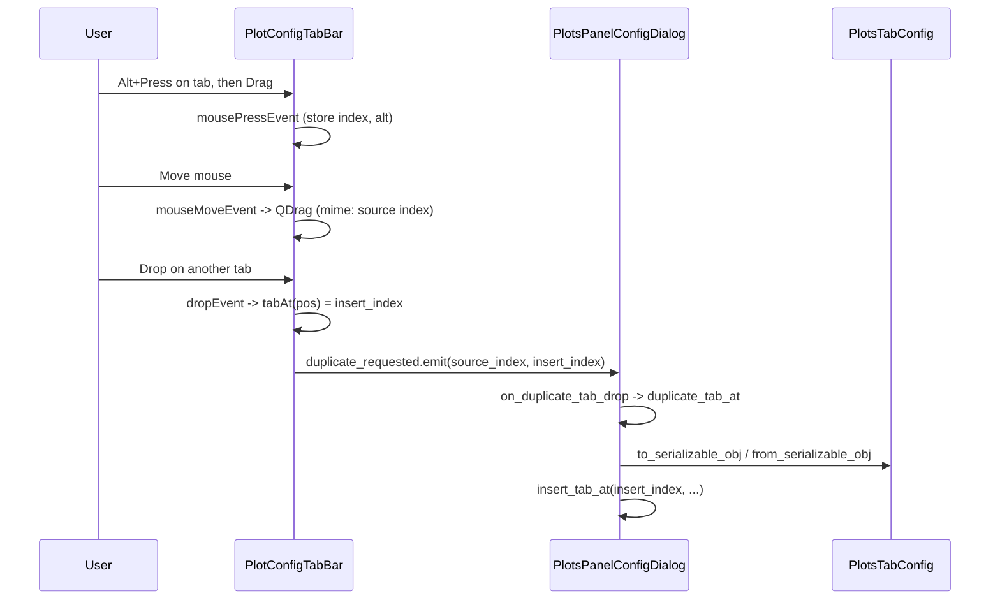

# Alt+Drag to Duplicate Plot Config Tab

## Context

- **Plot config manager**: [plots_panel_config.py](c:\Users\pho\repos\EmotivEpoc\ACTIVE_DEV\medusa-platform\src\medusa_platform\gui\plots_panel\plots_panel_config.py) — `PlotsPanelConfigDialog` uses a `QTabWidget`; each tab is one plot config (`PlotsTabConfig`). The last tab is a “+” add tab.
- **Existing duplication**: Right-click “Duplicate Tab” already exists: `show_tab_context_menu` → `duplicate_tab(index)` → serializes tab config, deserializes with name “ (copy)”, and `insert_tab_at(index + 1, ...)`.
- **Goal**: Same duplication, triggered by **Alt+Drag** on a tab: drag a tab with Alt held, drop on another tab (or the “+” tab) to create a duplicate; insert position = drop index.

## Approach

- Introduce a **custom `QTabBar**` that starts a drag only when **Alt** is held and the user drags a content tab (not the “+” tab). Mime data will carry the source tab index. On drop on the bar, insert a duplicate at the drop index.
- Reuse existing **serialization** and **insert_tab_at**; add a **duplicate_tab_at(source_index, insert_index)** so the new tab can be inserted at the drop position (context menu “Duplicate Tab” can keep calling `duplicate_tab(index)` → `duplicate_tab_at(index, index + 1)`).

## Implementation

All edits in [plots_panel_config.py](c:\Users\pho\repos\EmotivEpoc\ACTIVE_DEV\medusa-platform\src\medusa_platform\gui\plots_panel\plots_panel_config.py).

### 1. Custom tab bar class (new, near other widget classes ~line 227)

Add a `**PlotConfigTabBar**` subclass of `QTabBar`:

- **Mime type**: e.g. `application/x-medusa-plot-config-duplicate`; payload: source tab index (e.g. `str(source_index)` in mime text or a simple custom format).
- **State**: `_drag_tab_index` (int or None), `_alt_drag` (bool), `_drag_start_pos` (QPoint). Reset on press/release as needed.
- **mousePressEvent**: If left button and `tabAt(event.pos())` is a valid content tab (index in `[0, count()-2]`, since last is “+”), set `_drag_tab_index = tabAt(event.pos())`, `_alt_drag = (event.modifiers() & Qt.AltModifier)`, `_drag_start_pos = event.pos()`.
- **mouseMoveEvent**: If `_drag_tab_index` is not None and `_alt_drag` and move distance &gt; `QApplication.startDragDistance()`, create `QMimeData` with the mime type and source index, start `QDrag(self)` with that mime data (optional: set a simple pixmap or leave default), then `drag.exec(Qt.CopyAction)`, and clear `_drag_tab_index`.
- **mouseReleaseEvent**: Clear `_drag_tab_index`.
- **dragEnterEvent / dragMoveEvent**: If `event.mimeData()` has the duplicate mime type, `event.acceptProposedAction()` (or accept for copy).
- **dropEvent**: `drop_index = tabAt(event.pos())`. If `drop_index >= 0` (including “+” tab, which is `count()-1`), read source index from mime data; emit a signal e.g. `**duplicate_requested = Signal(int, int)**` with `(source_index, drop_index)`. Then `event.acceptProposedAction()`.
- **setAcceptDrops(True)** in `__init__`.

Keep the class small and consistent with existing style (e.g. single-line method signatures where reasonable, two blank lines between methods per user preference).

### 2. Use custom tab bar in the dialog

In `**create_layout()**` (right after `self.tab_widget = QTabWidget()` and `setTabsClosable(True)`):

- Instantiate the custom bar: `self._plot_config_tab_bar = PlotConfigTabBar(self.tab_widget)` (parent = tab widget).
- Replace the default bar: `self.tab_widget.setTabBar(self._plot_config_tab_bar)`.
- Connect the signal: `self._plot_config_tab_bar.duplicate_requested.connect(self.on_duplicate_tab_drop)`.

All existing `tab_widget.tabBar()` calls will now use this bar (tabBar() returns the bar we set). No need to change `handle_tab_click`, `edit_tab_name`, `remove_tab`, or `show_tab_context_menu`.

### 3. Duplicate at drop index in the dialog

- Add `**on_duplicate_tab_drop(self, source_index, insert_index)**`: call `self.duplicate_tab_at(source_index, insert_index)`.
- Add `**duplicate_tab_at(self, source_index, insert_index)**`: same logic as current `duplicate_tab(index)` but insert at `insert_index` instead of `index + 1`. That is: get `tab_config = self.config.tabs_config[source_index]`, build `data = tab_config.to_serializable_obj()`, set `data['lsl_config']`, `data['theme_colors']`, `data['tab_name'] = tab_config.tab_name + ' (copy)'`, then `new_config = PlotsTabConfig.from_serializable_obj(data)`, then `self.insert_tab_at(insert_index, new_config.tab_name, new_config)`.
- Refactor `**duplicate_tab(self, index)**` to call `**duplicate_tab_at(index, index + 1)**` so the context menu keeps the same behavior.

## Flow (mermaid)

## Edge cases

- **Drag without Alt**: Do not start the duplicate drag (no mime data, no drag or normal tab bar behavior). So only Alt+drag triggers duplicate.
- **Drop on “+” tab**: `tabAt` returns `count()-1`; inserting at `count()-1` is correct (new tab before “+”), so allow it.
- **Source index vs insert index**: When building the duplicate, use current `config.tabs_config[source_index]`; then insert at `insert_index`. Indices are valid as long as we don’t remove the source tab (we only add).

## Testing

- Open plot config dialog, Alt+drag a content tab and drop on another tab or on “+”: a new “&lt;name&gt; (copy)” tab should appear at the drop position.
- Without Alt, dragging a tab should not start a duplicate drag (no new tab).
- Right-click “Duplicate Tab” should still add “&lt;name&gt; (copy)” immediately after the right-clicked tab.

