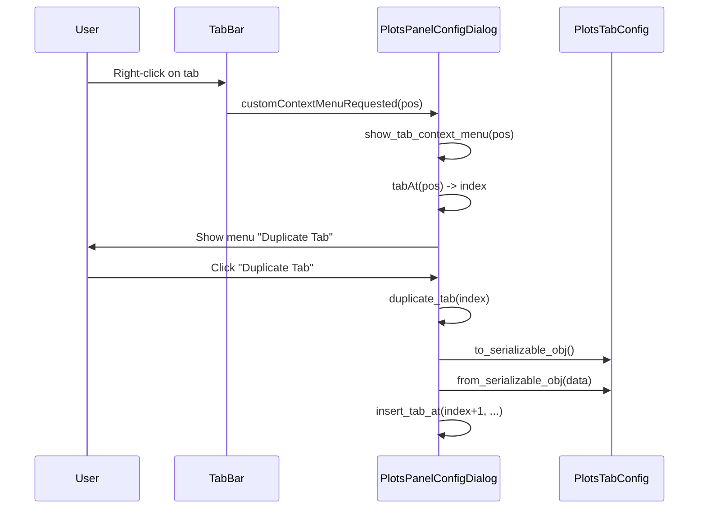

# Duplicate Tab for Plot Config Dialog

## Context

The plot configuration UI lives in [plots_panel_config.py](c:\Users\pho\repos\EmotivEpoc\ACTIVE_DEV\medusa-platform\src\medusa_platform\gui\plots_panel\plots_panel_config.py). Tabs are managed in `PlotsPanelConfigDialog` via a `QTabWidget`; the last tab is a special “+” tab for adding new tabs. Tab config is stored in `PlotsConfig.tabs_config` (list of `PlotsTabConfig`). Duplication will use existing serialization: `PlotsTabConfig.to_serializable_obj()` and `PlotsTabConfig.from_serializable_obj()` (the latter expects `lsl_config` and `theme_colors` in the dict, as in `set_config`).

## Implementation

All edits in [plots_panel_config.py](c:\Users\pho\repos\EmotivEpoc\ACTIVE_DEV\medusa-platform\src\medusa_platform\gui\plots_panel\plots_panel_config.py).

### 1. Tab bar context menu setup

In `**create_layout()**` (around the existing tab widget signal connections, after `tabCloseRequested.connect(self.remove_tab)`):

- Set the tab bar context menu policy:  
`self.tab_widget.tabBar().setContextMenuPolicy(Qt.CustomContextMenu)`
- Connect the tab bar’s `customContextMenuRequested` to a new handler, e.g. `self.show_tab_context_menu`.

### 2. Context menu handler

Add `**show_tab_context_menu(self, pos)**`:

- Resolve the tab index: `index = self.tab_widget.tabBar().tabAt(pos)`.
- If `index < 0` or `index == self.tab_widget.count() - 1` (the “+” tab), return without showing a menu.
- Create a `QMenu`, add an action **“Duplicate Tab”**, and connect it to a call that duplicates the tab at `index` (e.g. `lambda: self.duplicate_tab(index)`).
- Show the menu at the cursor: `menu.exec_(self.tab_widget.tabBar().mapToGlobal(pos))`.

### 3. Insert tab at index

Add `**insert_tab_at(self, insert_index, tab_name, tab_config)**` so duplication can insert the new tab right after the source tab (instead of only appending via `add_new_tab`):

- Build the tab widget:  
`tab_widget = PlotsTabConfigWidget(tab_config, self.lsl_config, self.theme_colors)`
- Insert into the UI:  
`self.tab_widget.insertTab(insert_index, tab_widget, tab_name)`
- Keep config in sync:  
`self.config.tabs_config.insert(insert_index, tab_config)`
- Switch to the new tab:  
`self.tab_widget.setCurrentIndex(insert_index)`

Use a single-line signature and minimal body; follow existing style in this file (e.g. `add_new_tab`).

### 4. Duplicate tab logic

Add `**duplicate_tab(self, index)**`:

- Get source config: `tab_config = self.config.tabs_config[index]`.
- Serialize and prepare for deserialize:  
`data = tab_config.to_serializable_obj()`  
then set `data['lsl_config'] = self.lsl_config`, `data['theme_colors'] = self.theme_colors`, and `data['tab_name'] = tab_config.tab_name + ' (copy)'`.
- Deserialize: `new_config = PlotsTabConfig.from_serializable_obj(data)`.
- Insert the new tab immediately after the current one:  
`self.insert_tab_at(index + 1, new_config.tab_name, new_config)`.

No changes to `PlotsConfig` or `PlotsTabConfig` are required; duplication reuses existing serialization and UIDs are scoped per tab.

## Flow (mermaid)

## Testing

- Open the plot config dialog (Configure plots), right-click a content tab (not the “+” tab): “Duplicate Tab” should appear; choosing it should add a new tab “&lt;name&gt; (copy)” right after the clicked tab with the same layout and plot settings.
- Right-click on the “+” tab: no context menu (or menu not shown) so behavior stays correct.

